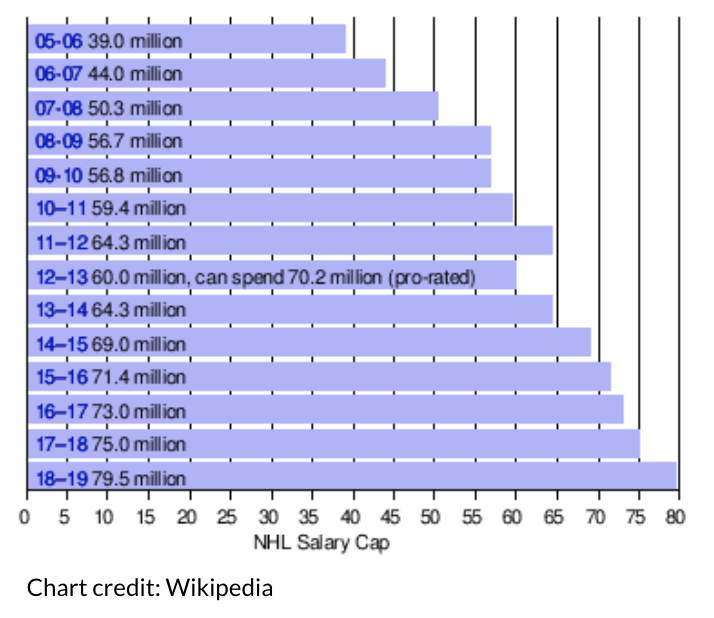
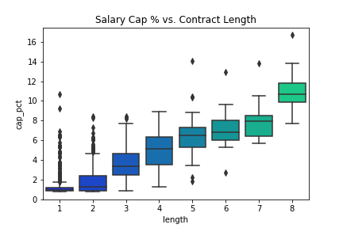
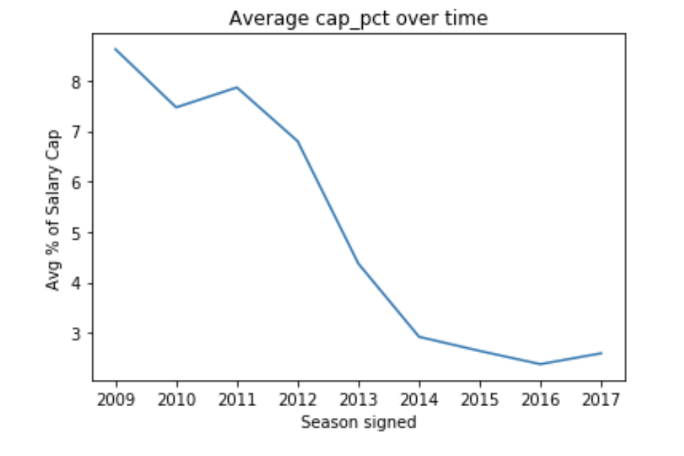
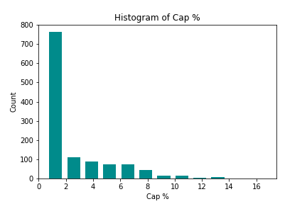
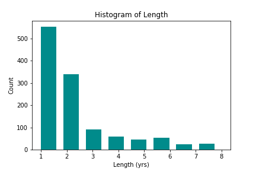
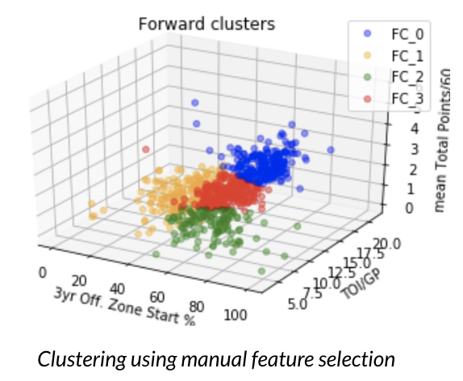
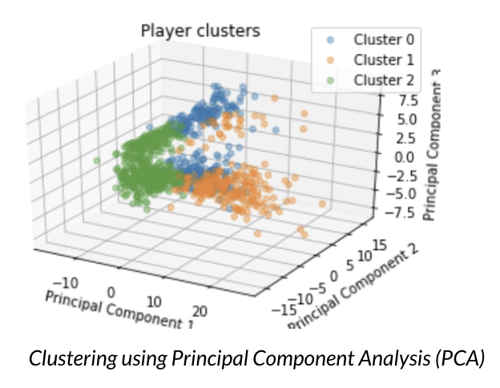
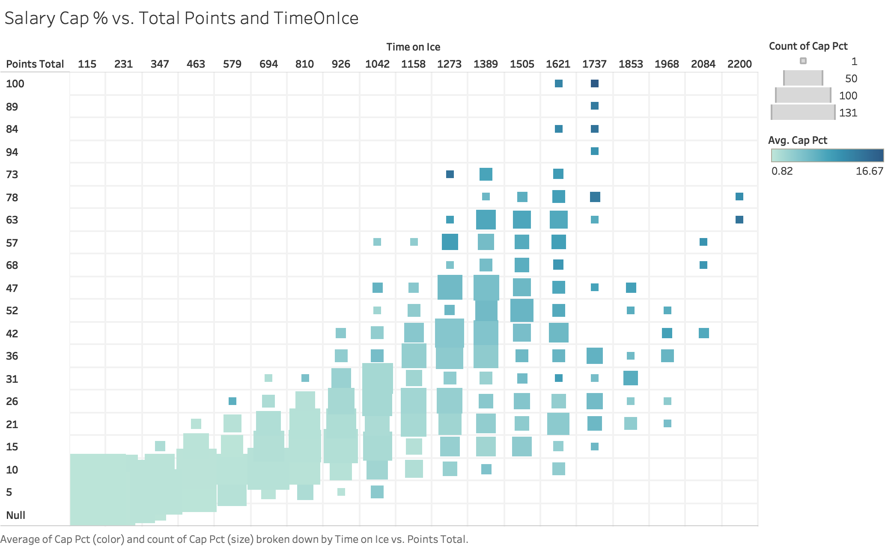
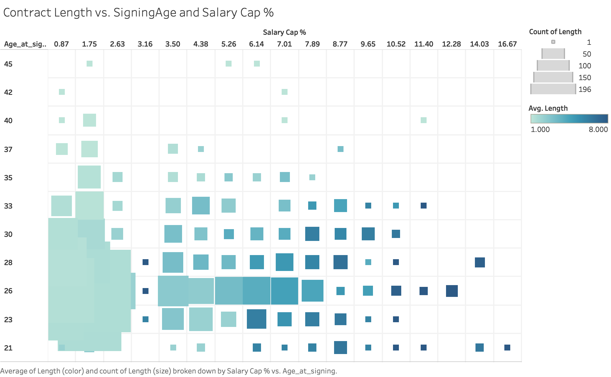
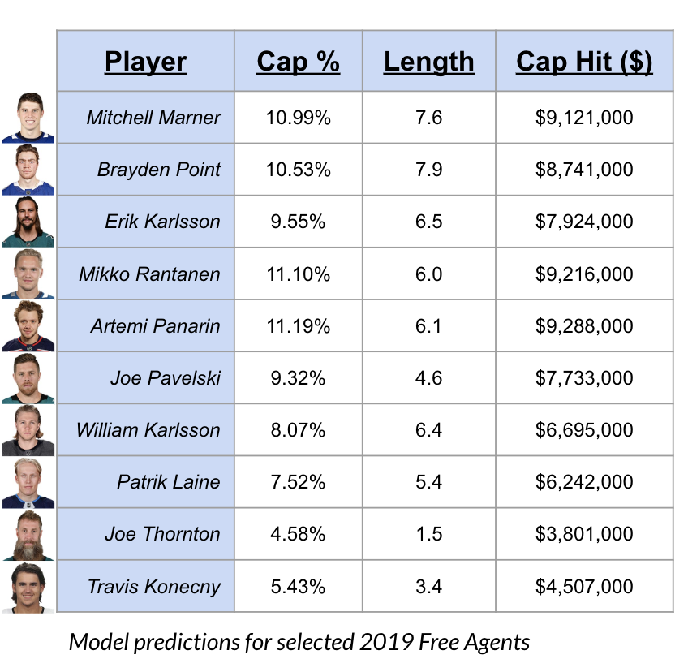

## nhl-contract-predictions
### Predict NHL player contract terms (salary and length) from their in-game stats

This project looks at predicting two targets, NHL player salary cap hits and length of contract.

### Table of Contents:
 * [Background](#Background)
 * [Goal](#Goal)
 * [Data](#Data)
 * [Model](#model)
    - [Modeling Choices](#modeling-choices)
    - [Error Metric and Baseline](#error-metric-and-baseline)
    - [Clustering](#kmeans-clustering)
    - [Nearest Neighbors Regressors](#nearest-neighbors-regressors)
    - [Gradient Boosting Regressor](#gradient-boosting-regressor)
 * [Conclusions](#conclusions)
    - [Important Features](#permutation-importance)
    - [Results](#results)
    - [Tools used](#tools-and-resources-used)
    - [Special Thanks](#special-thanks)

## Background:
#### The NHL salary cap:
One of the defining features of most modern sports leagues (including the NHL) is a salary cap. The salary cap sets a hard limit on how much each team can spend on its players’ contracts in a given year. It enforces parity and keeps leagues competitive and interesting. Previously successful or independently wealthy teams cannot enrich themselves further by outspending poorer teams. This ensures wider appeal in the entire league, and for the most part, prevents the same few teams from constantly being in power.  
As such, managing a team’s contracts and salary cap space is extremely important for any team that wants to even pretend to be competitive. Most continually successful teams are very good at not overpaying their high-end talent and identifying key players that can be valuable without putting too big a dent in the team’s salary cap situation. Teams are always looking to get better for cheaper.
More data on the salary cap is available from [Wikipedia here](https://en.wikipedia.org/wiki/NHL_salary_cap).

## Goal:
Develop a machine learning model to predict contract salaries and lengths for NHL free agents based on their in-game stats.

## Data:
Contracts were obtained with permission from [PuckPedia.com](https://puckpedia.com/) and included every player under an active NHL contract in the 2017-2018 and 2016-2017 seasons. In all, I had ~1200 contracts to work with once I eliminated goalies, entry level players, and those who signed contracts under the previous collective bargaining agreement.
Stats were downloaded in csv format from Natural Stat Trick.
I used Pandas rolling and aggregate functions to calculate average stats over the prior 3-year span.
The stats data was then merged with the contracts data so that every row contained a player contract and that player's stats over the season prior to signing and aggregated over 3 years prior to signing. After all of this, my data contained roughly 200 columns.
The raw data and the cleaned / featurized / merged data were then stored in SQL databases using a Postgres image on a Docker container.  
One major challenge in dealing with the data in this problem was the relatively low sample size. This resulted in high variance models, making it difficult to evaluate the impact of individual changes.

  
There's some natural survivorship bias in older contracts. The average percentage of salary cap value of contracts increases as you go farther back in time since my data only contains active contracts for the last 2 seasons. The only contracts still active from those older years are for higher tier players.

Features and trends that stood out:
 - Goals and Assists had a clear and significant positive correlation to salary
 - Penalties in general did not have a very visible effect, but major penalties had a strong negative effect (Skilled players tend to fight less).
 - Higher cap hit corresponds to higher cumulative stats (this makes sense because they play more).
 - Older players tend to sign shorter contracts, as do younger players with lower stats.
 - Elite players who are younger or in their prime usually get signed to max length contracts. This makes sense as the team gets to lock up the player's talent long term, and the player gets financial security.
 - The data distribution is clearly weighted towards many contracts of lower salary and shorter length, but averages are brought up by the best players being paid significantly more.

## Model:

### Modeling Choices:
* Since the salary cap changes inconsistent amounts from year to year (it has always moved upwards, but in theory it could shrink) predictions are made against the contract's percentage of the salary cap at year of signing.
  - The cap hit in real dollars was then calculated by referencing the listed salary cap for that year on [wikipedia](https://en.wikipedia.org/wiki/NHL_salary_cap).
* Stats were aggregated over a 3-year window because this is a student project and that was the available window for relative on-ice statistics from Natural Stat Trick without paying. While I could have aggregated cumulative stats over a larger window I chose not to for consistency.
* In the cases where a player did not have 3 years of NHL stats before signing his contract, I chose to fill in aggregates with stats over the available time window.
* Entry Level Contracts were excluded from my model's training set as I am only predicting standard level contracts once a player has time played in the NHL.
* Contracts signed before 2010 were excluded as Natural Stat Trick's data only goes back to 2007, thus there is no 3 year window.
* On top of that I decided to exclude all contracts signed before the last Collective Bargaining Agreement in 2013 to eliminate bias from contracts signed under a different set of rules.
* My goal is to predict two targets, salary and contract length. However, sklearn's machine learning package supports predicting a single target. As such, I chose to predict the two targets sequentially, feeding the predicted salary into the model for contract length as an additional feature.  

### Error Metric and Baseline
To evaluate my model I selected Root Mean Squared Error (RMSE) due to its interpretability and applicability to regression problems. One main advantage of RMSE over some other error metrics is that it can be expressed in the same units as our targets, dollars and years.  

The mean NHL contract is signed at 2.6% ($2,150,000/year assuming a 2019 cap of $83 million) of the salary cap and is 2 years long.

RMSE pick mean cap %: 2.9%
    translates to 2019 Cap Hit of: $2,407,000
RMSE pick mean length: 1.9 years

### kMeans Clustering:
One notion I had going into this project was that there are different types of players who would have different stats valued differently when it comes to contract negotiations. I hypothesized that these inherent players groups could be separated and a more accurate model could be achieved by running separate linear models on each cluster independently.  
I ultimately had to reject this hypothesis as I found no method of clustering the players that resulted in cleanly separable groups. Running independent models on these clusters did no better than running a global non-parametric model. In fact by further segmenting my already small dataset, the variance problem became even worse.  
Another factor reducing the effectiveness of clustering was the high dimensionality of the data, which often made computed distances end up being completely arbitrary. I tried selecting features that I thought would well-define player usage (such as Offensive Zone Start % and TOI/GP) with mediocre results. Objective dimensionality reduction using Principal Component Analysis (PCA) did not help either.

### Nearest Neighbors Regressors:
Nearest neighbors regressors were evaluated as another possible metric for evaluating salaries (k Nearest Neighbors and Radius Neighbors). In fact this was how I believed salaries were evaluated going into this process. However as encountered before with clustering, due to the high dimensionality of the data, a player's "nearest neighbors" would often have little to do with him in the way of actually meaningful performance statistics, or would often have few to none neighbors in a predetermined "radius". This made for wildly inconsistent results when it came to a predictive model.

### Gradient Boosting Regressor:
I tried several different regression models and found that ensembled decision tree based models such as Random Forest Regression and Gradient Boosting Regression consistently outperformed both linear models and neighbor based models. Gradient Boosting Regression proved to ultimately be the most consistent algorithm and usually outperformed the other models. The cleaned and compiled data was run through sklearn's Gradient Boosting Regressor algorithm to generate a predictive model.   
One thing that made the decision tree models so much more consistently effective than neighbors regressors is their independence from distance metrics. Their ability to handle unique situations and non-linearities in the data trends was also incredibly valuable.

## Conclusions

### Permutation Importance
I calculated feature importances using the Random Forest Permutation Importance (RFPimp) module. The permutation importance of a feature is calculated as the change in model score that arises from randomly scrambling the values for that feature while holding all others the same.

#### Important Salary Features
* Total Points (Goals + Assists - 1 year)
* Time on Ice (TOI) (1 year cumulative)
* TOI / Game (3 year mean)
* TOI / Game (1 year)
* iCF (Player total shot attempts - 1 year)  

I've displayed here the 5 features that came out with the highest importance to the salary model. Intuitively, these should make sense, players that score more and play more are likely to make more money. While player position was a feature, it didn't appear here, which I found interesting, although it may be subtly encoded within the 3rd and 4th feature, TOI / Game as there is such a huge split between the positions.  I did not include injury history as a feature in my model, but cumulative TOI encodes some information about whether the player missed time due to injury. I found the inclusion of iCF shot attempts interesting as well in that there could be some growing consideration for advanced stats in salary decisions.  
In the plot below, TOI and Total Points are plotted against each other, where point size is the frequency of players being in that statistical area, and color represents the magnitude of their salary.  

#### Important Length Features
* Predicted Cap %
* Player Age

There were other features fed into the length model, but these two were far and away the most important, which makes sense. One would think salary is normally a much larger sticking point for contracts than length.
I found it even more interesting that even when given all of the same features as the salary model, the salary prediction turned out to be the single most important feature to split tree decisions on.
As you can see below, older players tend to get shorter contracts, while younger players or those in their prime who have earned high salaries tend to get the longest contracts.  
This plot is similar to the one above, except the points represent contract lengths and the axes are player age and salary.

### Results:
After running my model on the test set for the data, I ended up with RMSE of 0.97% and 1.0 years respectively for salary and contract length. This converts to roughly $805,000 in 2019. Comparing this to the baseline model of selecting the mean contract every time, we find a *67% improvement on salary, and a 47% improvement on contract length*.  
We can convert this to total value by multiplying salary and contract length to obtain a single value for *improvement of 58%* over the baseline.

RMSE pick mean cap_pct: 2.9%
    translates to 2019 Cap Hit of: $2,407,000
RMSE pick mean length: 1.9 years

RMSE Cap_pct: 0.97% (**Improvement: 67%**)
    translates to 2019 Cap Hit of: $805,100
RMSE Length: 1.0 years (**Improvement: 47%**)

RMSE for predicting mean Total Value: $17,899,000
RMSE for Gradient Boosted Model Total Value: $7,523,000
**Improvement: 58.0%**

As a final step, I fed the upcoming crop of 2019 free agents into my model to see the results. I've displayed a few of the more prominent free agents in the following table, and the full results are viewable as a csv in the conc folder.

  

By eyeballing it, I might tweak a few of the numbers here and there, but none of the predictions are truly surprising to me. I think that part of it is a matter of recent trends or a few splashy contracts affecting our subjective perceptions, but not providing enough of a quantitative nudge to influence the machine learning model. We'll find out in July!

### Tools and Resources used:  
 - Python
 - sklearn  
 - pandas  
 - matplotlib
 - seaborn
 - Tableau
 - SQL
 - PuckPedia (contract data)
 - Natural Stat Trick (statistics data)
 - NHL API  

### Special Thanks:
 * Thanks to PuckPedia for sharing their contracts database with me
 * Natural Stat Trick for having advanced stats data freely available for download
 * The instructors and my fellow classmates at Galvanize

## About the Author:  
Colin Shanahan is a San Francisco based former mechanical engineer turned Data Scientist and a student at Galvanize's Data Science Immersive program. He is also a huge hockey fan.  
You can reach him on [LinkedIn](https://www.linkedin.com/in/c-shan).
